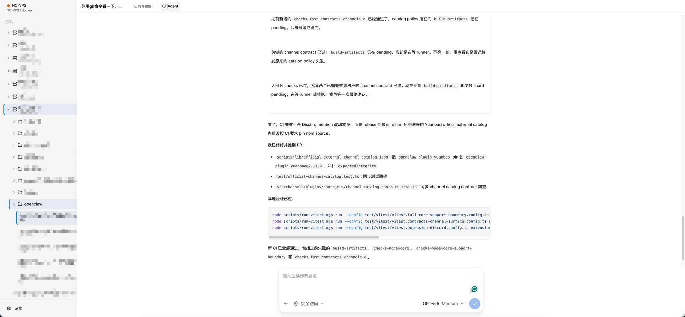

# Codex Gateway

[](nuxt.config.ts)
[](package.json)
[](package.json)
[](package.json)
[](tests/e2e)
[](docker-compose.yml)
[](LICENSE)

English | [中文](README.zh-CN.md)

Codex Gateway is a web frontend and connection gateway for the official Codex app-server.

It is not a reimplementation of Codex, and it does not run an agent runtime in the browser. The browser talks only to Codex Gateway. Gateway connects to your remote machines over SSH, manages the official `codex app-server` lifecycle, and renders official app-server threads, events, approvals, file changes, images, diffs, terminal output, and sub-agent activity in a web UI.

The goal is simple: open Codex sessions from many servers in a browser while keeping Codex app-server as the source of truth. If Codex Desktop, another client, and Codex Gateway connect to the same app-server thread, they should observe the same state stream.

<p align="center">
  
</p>

<p align="center"><sub>A browser workspace for Codex sessions running across remote SSH hosts.</sub></p>

## Why

- Use Codex from any browser without exposing SSH credentials to the browser.
- Manage multiple SSH hosts, projects, and Codex threads from one workspace.
- Keep official Codex app-server semantics instead of inventing a parallel protocol.
- Share one gateway-side SSH/RPC lifecycle per host across browser tabs.
- Recover thread state after browser reloads, app-server restarts, or temporary SSH disconnects.
- Open a direct SSH terminal next to the agent loop when you need to inspect or fix the remote environment manually.

## Architecture

```text
Browser
  └─ HTTP + WebSocket
     └─ Codex Gateway (Nuxt server)
        ├─ SQLite encrypted config
        ├─ SSH connection pool
        ├─ one shared RPC client per host
        ├─ direct SSH PTY terminal sessions
        ├─ thread/event cache
        └─ remote official codex app-server
```

Core rules:

- Browsers never connect directly to remote app-servers or SSH hosts.
- Gateway owns SSH, remote Codex upgrade, app-server startup, RPC, and event fan-out.
- Turn start, steer, interrupt, terminal input, terminal resize, and server-request responses use the page WebSocket.
- Gateway caches recent thread state, warms pinned threads, and periodically refreshes stale running threads from app-server state.
- The frontend renders domain state from Gateway and does not maintain a second durable timeline.

## Features

- **Server-side accounts and config**: manually created users, Bearer token login, encrypted host/project/thread config in SQLite.
- **Remote hosts**: SSH password, private key, ssh-agent, and optional SSH proxy support.
- **Codex runtime management**: detects remote Codex versions, upgrades old installs, restarts stale app-server processes, and reconnects automatically.
- **Thread discovery and restore**: discovers Codex sessions from remote state and opens threads with a small cached turn window first.
- **Realtime turns**: start new turns, steer running turns, interrupt active turns, and answer app-server dynamic requests over WebSocket.
- **Plan and goal modes**: slash commands expose Codex plan mode and goal progress, including token/time status in the composer.
- **Agent loop UI**: reasoning, command execution, terminal waits, file edits, streaming diffs, images, context compaction, sleep, MCP/tool calls, notifications, and sub-agent side panels.
- **Workspace tabs and file previews**: keep the agent loop, SSH terminals, sub-agents, and remote Markdown, code, PDF, and Office previews in one workspace.
- **Remote terminal tabs**: open independent SSH PTY terminals beside the agent loop with `@xterm/xterm`; terminal sessions are isolated per user and host.
- **Multi-client sync**: multiple browser tabs can subscribe to the same thread and receive the same gateway-side app-server event stream.
- **State repair**: after SSH/app-server reconnect, Gateway refreshes running thread state; a Nitro scheduled task also checks stale running threads.
- **Bark notifications**: server-side Bark push for completed main turns, de-duplicated per user and turn.
- **Mobile layout**: responsive sidebar, composer, long-press context actions, and sub-agent panels.
- **Real E2E coverage**: Playwright tests run against a real Nuxt server, real SSH Docker target, and real Codex app-server.

## Project Structure

```text
.
├── app/                       # Nuxt frontend, Pinia store, chat/thread/settings UI
├── app/components/ui/         # shadcn-vue base components
├── server/api/                # Browser-facing HTTP and WebSocket API
├── server/tasks/              # Nitro scheduled task entrypoints
├── server/utils/gateway/      # SSH, Codex RPC, runtime broker, storage, notifications
├── shared/                    # Shared DTOs, config, protocol helpers, thread history
├── i18n/locales/              # Chinese and English UI messages
├── tests/e2e/                 # Real SSH + app-server Playwright E2E
├── third_party/openai-codex/  # Official Codex source submodule for protocol reference
├── Dockerfile
└── docker-compose.yml
```

## Quick Start

Prerequisites: Docker with Compose, Git, and network access from Gateway to the SSH hosts you want to manage.

```bash
git clone --recurse-submodules https://github.com/yunhaoli24/codex-gateway.git
cd codex-gateway

cp .env.example .env
# Replace CODEX_GATEWAY_CONFIG_SECRET in .env with: openssl rand -hex 32

docker network create web-common 2>/dev/null || true
docker compose build
docker compose run --rm codex-gateway \
  node scripts/create-user.mjs admin '<a-password-with-at-least-8-characters>'
docker compose up -d
```

Open the service through your reverse proxy, sign in with the manually created account, and add the first SSH host from Settings. The bundled Compose file intentionally exposes port `3000` only to the external `web-common` Docker network.

## Local Development

```bash
pnpm install
pnpm dev
```

Common commands:

```bash
pnpm lint
pnpm build
pnpm test:e2e
```

Environment variables:

| Variable | Required | Description |
| --- | --- | --- |
| `CODEX_GATEWAY_CONFIG_SECRET` | Yes in production | Stable secret used to encrypt stored host/project/thread config. |
| `CODEX_GATEWAY_DB_PATH` | No | SQLite database path. Defaults to the app data path; Docker uses `/data/codex-gateway.db`. |
| `HOST` | No | Nuxt listen host. Docker uses `0.0.0.0`. |
| `PORT` | No | Nuxt listen port. Docker uses `3000`. |

Create an admin user:

```bash
CODEX_GATEWAY_CONFIG_SECRET="replace-with-a-long-random-secret" \
CODEX_GATEWAY_DB_PATH="./data/codex-gateway.db" \
pnpm user:create <username> <password>
```

`CODEX_GATEWAY_CONFIG_SECRET` encrypts stored connection config. Use a stable, sufficiently long secret in production. Changing it makes existing encrypted config unreadable.

## Security Model

- SSH credentials and Codex tokens stay on the server side.
- Browser clients authenticate to Gateway with a Bearer token.
- Stored connection config is encrypted in SQLite with `CODEX_GATEWAY_CONFIG_SECRET`.
- Direct terminal tabs are server-side SSH PTY channels; they do not expose SSH keys to the browser.
- Public deployments should run behind a trusted reverse proxy with HTTPS.

## Docker Deployment

```bash
export CODEX_GATEWAY_CONFIG_SECRET="replace-with-a-long-random-secret"
docker compose up -d --build
```

The compose service exposes container port `3000` only to Docker networks. Put it behind nginx, Caddy, Cloudflare Tunnel, or another trusted reverse proxy. SQLite data is stored at `/data/codex-gateway.db` and persisted through `./data:/data`.

## Testing

E2E tests do not mock Codex app-server:

- A production Nuxt build is started in the test runner.
- Docker provides a real SSH target.
- Gateway connects to the target over SSH and starts or resumes a real Codex app-server.
- Playwright verifies login, config, thread restore, realtime sync, mobile layout, diff rendering, dynamic requests, notifications, and sub-agent UI.

Run:

```bash
pnpm test:e2e
```

If the host machine does not have `pnpm`, use the containerized runner directly:

```bash
tests/e2e/run-in-containers.sh
```

Run the full E2E suite for changes involving SSH, RPC, WebSocket, thread state, config, upload, diff rendering, mobile layout, or app-server protocol handling.

## Relationship With Codex

Codex Gateway targets the official Codex app-server protocol. `third_party/openai-codex/` is a submodule used only as a protocol and behavior reference. Gateway should align with official app-server behavior instead of fabricating frontend-only events or maintaining compatibility branches for old protocols.

## Contributing

Issues and pull requests are welcome. Read [CONTRIBUTING.md](CONTRIBUTING.md) before changing SSH, RPC, realtime state, or app-server protocol behavior. Please report vulnerabilities privately according to [SECURITY.md](SECURITY.md).

## License

[MIT](LICENSE)
